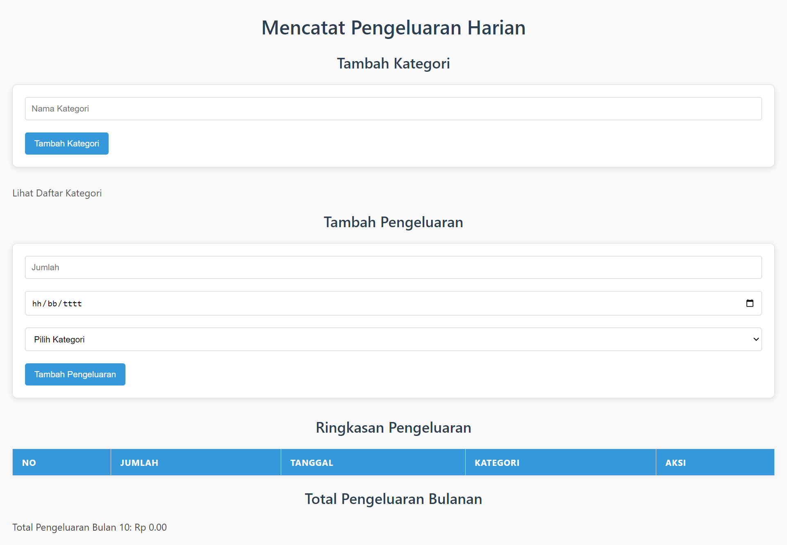

# Aplikasi Mencatat Pengeluaran Harian

Aplikasi Mencatat Pengeluaran adalah aplikasi sederhana berbasis web yang memungkinkan pengguna untuk mencatat pengeluaran harian dan mengelompokkan pengeluaran berdasarkan kategori. Aplikasi ini juga menampilkan ringkasan pengeluaran bulanan dan menyediakan fitur CRUD (Create, Read, Update, Delete) menggunakan PHP dan MySQL.

# Fitur
1. Tambah Kategori: Pengguna dapat menambahkan kategori pengeluaran, seperti "Makanan", "Transportasi", atau "Hiburan".

1. Tambah Pengeluaran: Pengguna dapat mencatat pengeluaran harian dengan memilih kategori yang sesuai.

1. Ringkasan Pengeluaran: Aplikasi menampilkan daftar pengeluaran lengkap dan ringkasan pengeluaran bulanan.

1. Edit Pengeluaran: Pengguna dapat mengedit jumlah pengeluaran, tanggal, dan kategori.

1. Hapus Pengeluaran: Pengguna dapat menghapus pengeluaran yang tidak diperlukan.

1. Validasi Input: Pengeluaran dengan nilai negatif tidak akan disimpan.